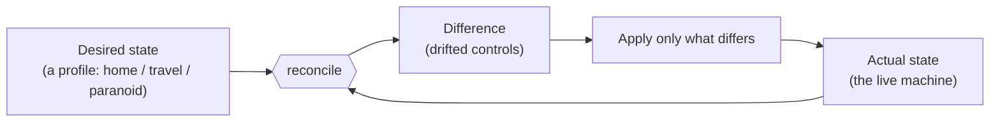
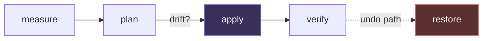
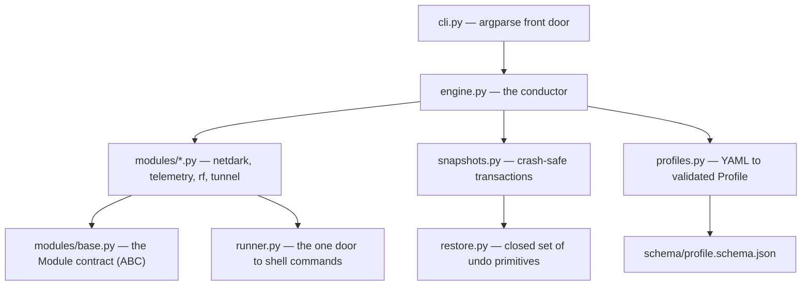
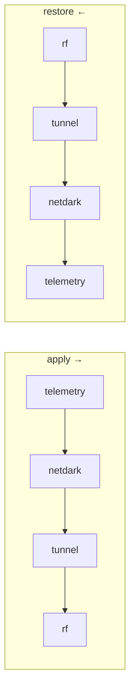
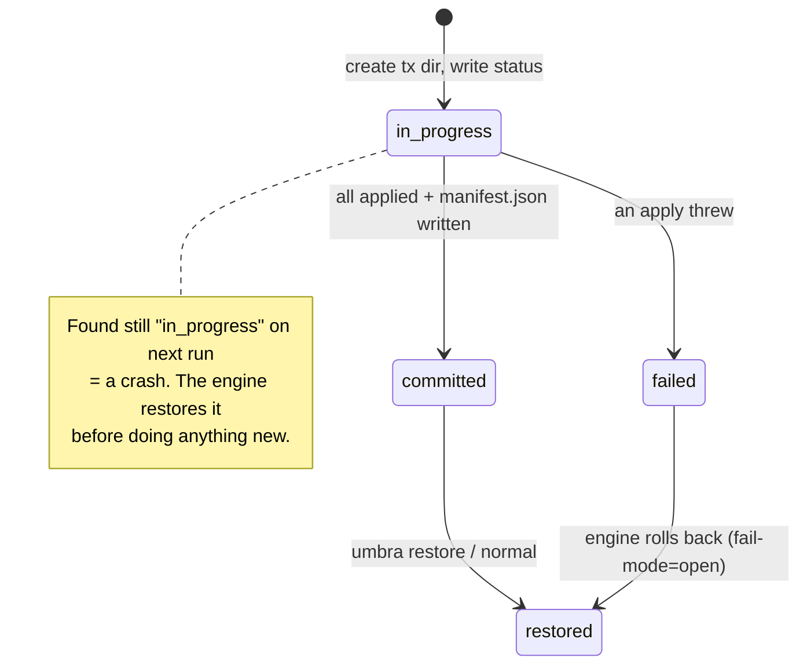
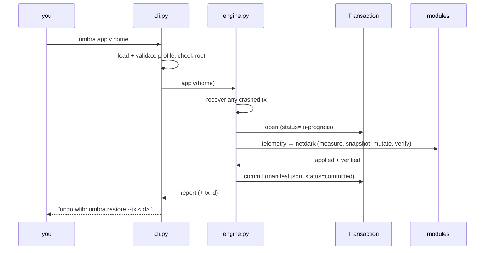

# Phase 1 — Engine + CLI (netdark & telemetry)

> A learning companion. Diagrams below are [Mermaid](https://mermaid.js.org/) and
> render automatically on GitHub. This doc explains *how Phase 1 works and why*,
> so you can read the code with the shape already in your head.

---

## 1. The one idea: Umbra is a *reconciler*

Umbra never "turns features on." You declare a **desired** state (a profile); it
measures the **actual** state of the machine, finds the difference, and closes
it. Same pattern as Kubernetes or Terraform.



This is why `umbra normal` needs no special code: "stock" is just a profile where
everything is off, and reconciling to it replays the undo snapshots.

---

## 2. The five-step lifecycle every control goes through

A **control** is one atomic, reversible change (e.g. "default-DROP firewall").
Every control is driven through the same five steps:



| Step | Question it answers | Touches the system? |
|------|--------------------|--------------------|
| `measure` | What is true right now? | reads only |
| `plan` | What must change? | no |
| `apply` | Make the change (after snapshotting) | **yes** |
| `verify` | Did it take? | reads only |
| `restore` | Put it back | **yes** |

**The golden rule:** never mutate what you haven't snapshotted first.

---

## 3. The code, as a dependency stack

Read the files bottom-up; each layer only knows about the ones below it.



Quick tour:

- **`profiles.py`** — reads YAML, resolves `extends` by deep-merging child over
  parent, then validates against the JSON Schema. A typo is a *hard error*
  (`additionalProperties: false`), because a security config must never silently
  no-op.
- **`runner.py`** — every `nft`/`systemctl`/`sysctl` call goes through
  `Runner.run()`. The `read_only` flag is the trick: probes always run (reading
  is safe); mutations are skipped-and-logged under `--dry-run`.
- **`modules/base.py`** — an Abstract Base Class: a module can't exist unless it
  implements all five lifecycle methods. Also home to the `Compliance` enum and
  `APPLY_ORDER`.
- **`restore.py`** — *restore is data, not code.* A snapshot stores a method
  *name* from a closed set plus plain data — never a shell string to execute.
- **`snapshots.py`** — the safety core (see §5).
- **`engine.py`** — orders the modules, wraps a run in one transaction, recovers
  crashes, applies fail-mode policy.

---

## 4. Apply order (and why it's fixed)

The engine — not the modules — decides sequence. Restore runs it in reverse.



Rationale: raise the telemetry/firewall **walls first**, bring the tunnel up
next, and touch **radios last** (they can drop your connection). So the machine
is never, even briefly, *more* exposed than where it started or where it's headed.

---

## 5. Crash safety — the promise that makes it trustworthy

> Umbra can undo itself even if it is killed mid-apply, or the power drops.

The mechanism is a **transaction**. One `apply` = one transaction directory. A
control's prior state is written and `fsync`'d to disk **before** the mutation.
The run is only "real" once `manifest.json` is committed last.



What a transaction looks like on disk:

```
engine/state/
  current                       -> points at the active transaction id
  transactions/
    2026-09-18T14-03-11Z_ab12/
      status                     in-progress | committed | failed | restored
      manifest.json              written LAST = the commit point
      telemetry/hosts_sinkhole.snap   full prior /etc/hosts
      netdark/inbound_policy.snap     full prior nftables ruleset
```

Because snapshots store the **whole** prior value (not a reverse-delta), undo is
just "write the old value back" — robust even if the in-between state is weird.

---

## 6. What netdark & telemetry actually do

Both follow the identical snapshot-first shape. `netdark._apply_firewall()` is
the philosophy in four lines:

```python
prior = runner.run(["nft", "list", "ruleset"], read_only=True)   # 1. read current
snap.record("netdark.inbound_policy", "nftables_replace",        # 2. snapshot FIRST
            {"ruleset": prior.stdout})
runner.run(["nft", "flush", "ruleset"], read_only=False)          # 3. then mutate
runner.run(["nft", "-f", "-"], read_only=False, input_text=RULES) #    install stealth
```

| Module | Real Phase-1 controls | Deferred (surfaced honestly) |
|--------|----------------------|------------------------------|
| **netdark** | DROP firewall, silence avahi (mDNS) + nmbd (NetBIOS), IPv6 temp addrs | llmnr, ssdp_upnp, wsd → "Phase 1.5" |
| **telemetry** | `/etc/hosts` DNS sinkhole, disable OS telemetry units | egress allowlist → Phase 2 (tunnel) |
| **rf**, **tunnel** | *(declared stubs — status lists them, they never act)* | whole module → Phase 2 |

The stealth firewall sets `policy drop` and answers nothing — not even a ping.
The `/etc/hosts` block is idempotent: applying twice strips the old block first,
so it can't accumulate.

---

## 7. Trace: `sudo umbra apply home`



If a step threw and the profile is fail-mode **open** (like `home`), the engine
restores the whole transaction — you're never stranded half-dark. A **closed**
profile (`travel`/`paranoid`) instead keeps the walls up and reports.

---

## 8. Try it yourself

```bash
umbra list                    # the profiles
umbra plan travel             # what would change
umbra status home             # measured posture vs the home profile
umbra --dry-run apply home    # rehearse, touching nothing
```

On a non-Linux dev box these run fine but report `UNKNOWN` (no `nft`/`/etc/hosts`).
The real thing is verified on Kali — see [`../DEVELOPING.md`](../DEVELOPING.md).

---

### The single sentence to remember

**measure → snapshot → mutate → verify — and never mutate what you haven't
snapshotted first.**
