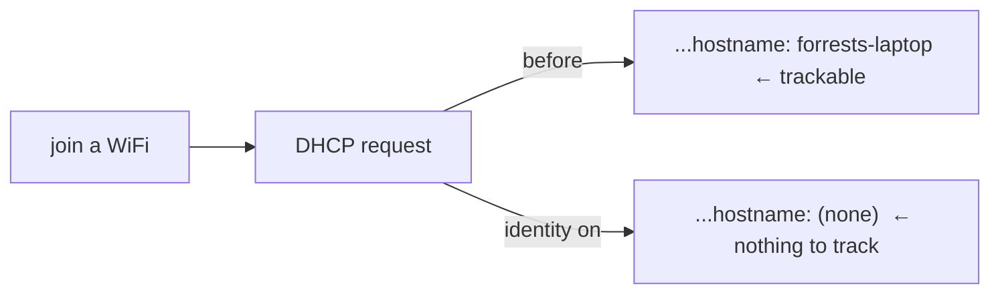
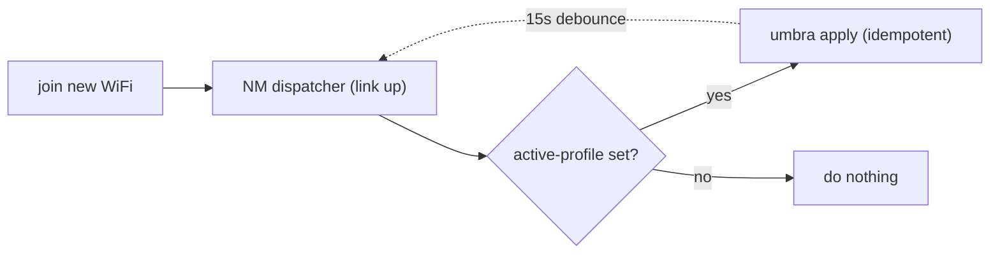
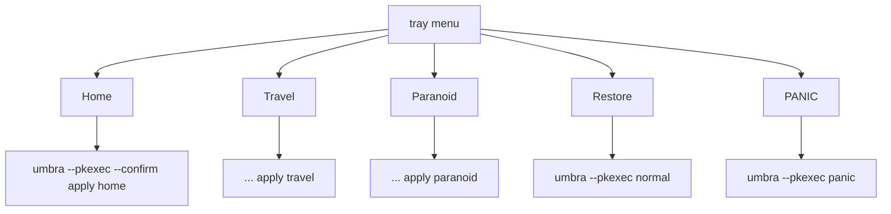

# Phase 10 — The product layer (identity, hardening, the one switch)

> Learning companion. Phases 0–9 built the engine and the security controls.
> Phase 10 is the batch that turns Umbra from "a hardening tool" into "a product":
> it closes an identity leak, deepens hardening, makes posture survive network
> hops, adds readiness/score/panic conveniences, and — the headline — a **tray
> toggle**: the literal one switch.

This is also the reference for the eventual **phone app**: the model (declarative
profiles → engine → audit → a simple front-end) is exactly what a mobile version
would re-implement on top of what the OS there allows.

---

## 1. Identity — you're more than your MAC

MAC randomization hides the hardware address, but the OS still **broadcasts its
hostname in every DHCP request**. `forrests-laptop` (or `kali`) then follows you
across every network — a stable identifier that survives MAC randomization
entirely. The new **identity** module drops a NetworkManager config
(`dhcp-send-hostname=false`) that closes it.

## 2. Kernel — hardening with teeth

The **kernel** module applies well-established hardening sysctls, each its own
reversible control: `kptr_restrict=2`, `dmesg_restrict=1`, `yama.ptrace_scope=2`,
`suid_dumpable=0`, `randomize_va_space=2` (full ASLR), `perf_event_paranoid=3`,
`rp_filter=1`. Plus `disable_webcam` (unload `uvcvideo`) in paranoid.

The instructive bit: **`kexec_load_disabled` and `unprivileged_bpf_disabled=2`
are deliberately excluded** — they're one-way (can't be reset until reboot), which
would break Umbra's clean-revert promise. A control that can't be undone doesn't
belong in a reversible engine.

## 3. Posture survives network hops

A posture is applied once — but you move between networks. `engine.apply` now
records the active profile to `/var/lib/umbra/active-profile`, and a
**NetworkManager dispatcher** re-applies it on every link-up:

`apply` is idempotent (acts only on drift), so this is cheap; a 15-second
debounce stops the MAC/hostname reload from looping the dispatcher.

## 4. Conveniences

- **`umbra doctor [profile]`** — a read-only readiness check: are `nft`,
  `wg-quick`, `tor`, the WireGuard config, etc. present for this profile? Fails up
  front with "install X" instead of mid-apply.
- **Posture score (0–100)** — the audit now grades itself (OK=1.0, WARN=0.3,
  FAIL=0; INFO/NA ignored) and shows it in `umbra audit` and the dashboard header.
- **`umbra panic`** — one command to go dark now (apply paranoid).
- **`umbra vpn <file>`** — import any WireGuard config to
  `/etc/wireguard/vpn.conf` so `travel` can use it.

## 5. The one switch — `umbra tray`

A GTK AppIndicator in the system tray. Pick a posture; it runs
`umbra --pkexec …`, so polkit shows one auth dialog and no root shell is needed.

The design keeps the GUI dependencies (`PyGObject` + an AppIndicator) *inside*
`run()`, so the module imports and unit-tests anywhere; only actually launching
the tray needs a desktop. That separation — pure logic vs. platform front-end —
is the same line the phone app will draw.

---

### One-liner for Phase 10

**Close the hostname leak, deepen the kernel, keep posture across networks, and
put the whole engine behind a single tray switch — the product, not just the
tool.**
