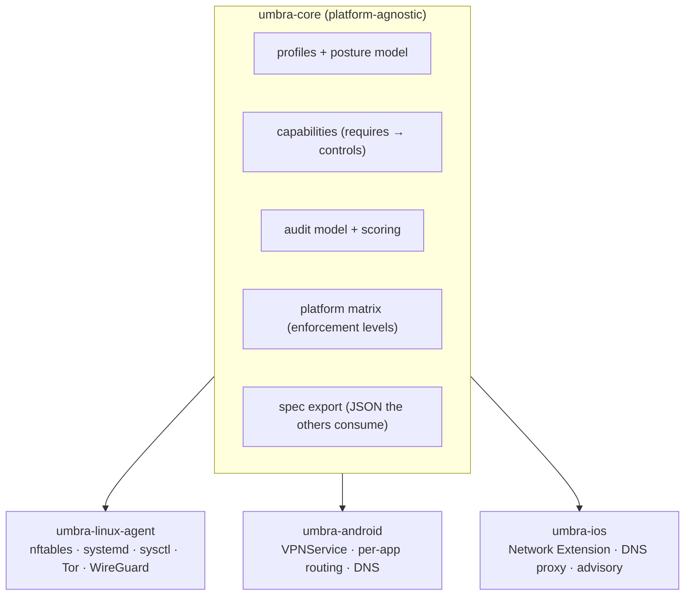
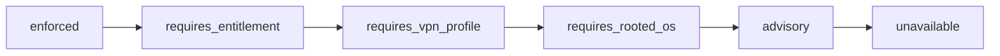

# Phase 16 — The platform boundary (making the phone app honest)

> Learning companion. Phases 0–15 built the Linux reference. Phase 16 doesn't add
> a control — it draws the line the phone app must live behind, so the eventual
> Android/iOS builds can be **honest** about what they can and can't do instead of
> pretending to be Linux.

The audit flagged it directly: the code is strongly Linux-specific (nftables,
systemd, NetworkManager, sysctl, rfkill, Tor system service, `/etc/hosts`,
`/etc/resolv.conf`, polkit, GTK). That's correct *for the reference
implementation* — but none of it ports to a stock phone. So before any app code,
we define the boundary.

---

## 1. Three layers, one source of truth



**Core** is the shared brain: what a posture *means*, which controls satisfy each
promise, how the audit scores it, and — new in this phase — **what each platform
can honestly enforce**. It has no Linux imports. Everything platform-specific is
an *agent* (Linux) or an *adapter* (Android/iOS) hanging off the core.

The Linux code already respected most of this line, and Phase 16 makes it
**enforced, not incidental**. The pure posture types moved to `umbra/model.py`
and the audit model to `umbra/auditmodel.py`, so the core
(`model`, `profiles`, `capabilities`, `platform`, `auditmodel`, `report`, `spec`)
imports nothing from the Linux agent (`engine`, `snapshots`, `restore`, the
concrete `modules/*`, `cli`, …). [`tests/test_boundary.py`](../../tests/test_boundary.py)
proves it two ways: importing the core in a fresh interpreter pulls in **zero**
enforcement modules, and no core module may `import` an agent module. Cross the
line and the build goes red.

The adapters live beside the core as [`android/`](../../android/) (Kotlin,
VPNService) and [`ios/`](../../ios/) (Swift, Network Extension) — thin front-ends
that read the exported spec.

## 2. The honest part — enforcement levels

`Compliance` (compliant/drift/unknown/unsupported) answers "did the control take?"
That's not enough for a phone, because a phone often *can't* take the control at
all. So the core adds a second, platform-facing axis: **how strong a promise can
this OS make about this capability?**



| Level | Meaning |
|---|---|
| `enforced` | Guaranteed with ordinary app permissions. |
| `requires_entitlement` | Enforced once the OS grants a special entitlement (VPN consent, Network Extension). |
| `requires_vpn_profile` | Enforced only while an Umbra tunnel/VPN profile is running. |
| `requires_rooted_os` | Only possible with root / a custom OS build. |
| `advisory` | The app can measure and warn, but cannot change it. |
| `unavailable` | Not applicable or impossible on this platform. |

A UI must render these as **six distinct states** and never collapse them into a
green "on". "Advisory" with a checkmark would be the exact dishonesty the project
exists to avoid.

## 3. The matrix (what the phones can actually do)

The full table lives in [`umbra/platform.py`](../../umbra/platform.py); the shape
of it:

| Capability | Linux | Android (no root) | iOS |
|---|---|---|---|
| firewall (inbound) | enforced | requires_rooted_os | unavailable |
| telemetry sinkhole | enforced | requires_vpn_profile | requires_entitlement |
| wireguard | enforced | requires_entitlement | requires_entitlement |
| tor | enforced | requires_vpn_profile | requires_vpn_profile |
| kernel hardening | enforced | requires_rooted_os | unavailable |
| mac randomization | enforced | advisory¹ | advisory¹ |
| bluetooth off | enforced | advisory | advisory |

¹ Both phones already randomize the MAC per-network by default — the app can
*verify* it but can't force it, which is exactly what `advisory` says.

The lesson in one row: **Android's VPNService is the phone's superpower.** It
gives real egress routing, DNS filtering, and a tunnel *without root* — so
telemetry-blocking, WireGuard, and Tor are genuinely deliverable (behind a
one-time VPN consent). The kernel and the system firewall are not, and the matrix
says so.

## 4. The contract on the wire — `umbra export-spec`

The Linux agent is Python, Android is Kotlin, iOS is Swift. If each re-encoded the
profiles and the matrix, they'd drift. Instead the Python core is the single
source and emits a language-neutral JSON spec:

```bash
umbra export-spec            # writes spec/umbra-core.json + spec/umbra-core.schema.json
umbra capabilities --platform android --profile travel
```

[`spec/umbra-core.json`](../../spec/umbra-core.json) carries the enforcement
levels, the capability definitions, the full per-platform matrix, every profile
(with its required capabilities), and the audit shape. The Android/iOS adapters
read *this* — so all three platforms speak the same posture language, and a test
(`test_checked_in_spec_is_up_to_date`) fails if the committed spec drifts from the
core.

## 5. What the phone app is (and isn't)

The phone app is a **thin front-end over the core**, plus a platform adapter that
enforces what it can and *reports* the rest:

- Pick a profile → the app looks up each required capability in the matrix.
- `enforced` / `requires_*` → the adapter does it (asking for consent if needed).
- `advisory` → the app shows the current state and a one-tap deep-link to the OS
  setting, but claims nothing.
- `unavailable` → the app says so, plainly.

Same model as the Linux tray (`umbra/tray.py`): pure logic in the core, the
platform front-end kept at the edge. That line — drawn here — is what lets one
posture model run truthfully on a laptop, an Android phone, and an iPhone without
any of them lying about the others' powers.

---

### One-liner for Phase 16

**Split the brain from the hands: a platform-agnostic core that says, per
capability, exactly what each OS can honestly enforce — so the phone app can be a
truthful front-end instead of a Linux impersonation.**
