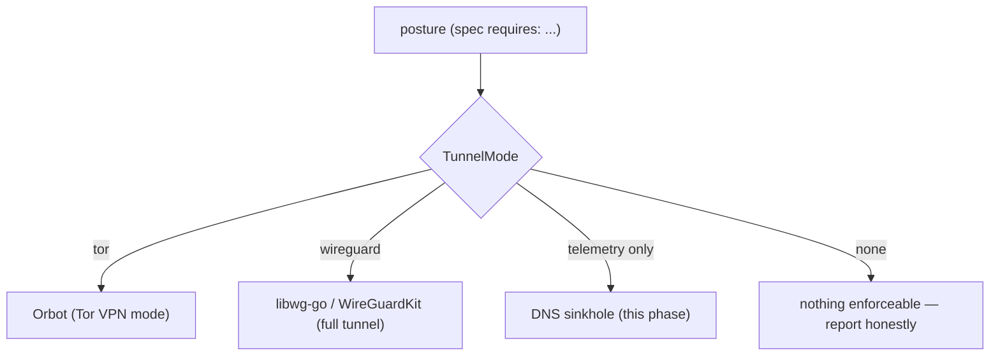
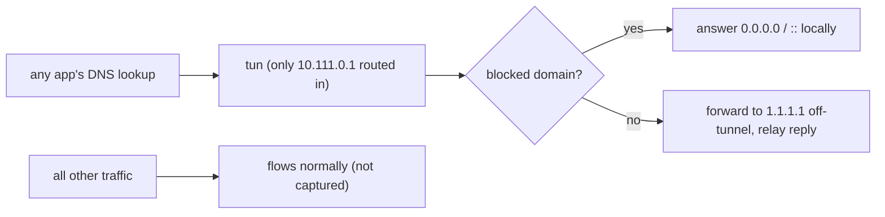

# Phase 17 — The mobile datapath (making the phone actually enforce)

> Learning companion. Phase 16 drew the platform boundary and said, per
> capability, what each OS can honestly enforce. Phase 17 builds the Android and
> iOS **datapaths** that make those promises real — starting with the one an
> unrooted phone can genuinely keep: blocking telemetry DNS.

Both apps are thin front-ends over the shared core spec
([`spec/umbra-core.json`](../../spec/umbra-core.json)). Everything below is the
*adapter* — the platform-specific hands that do what the matrix marks actionable,
and honestly report the rest.

---

## 1. The one lever without root: the VPN slot

Neither a stock Android phone nor an iPhone lets an app touch the firewall, the
kernel, or the radios. The single thing they *do* grant, after one consent, is a
**VPN slot** — Android's `VpnService`, iOS's Network Extension. That's the lever
every real enforcement rides.

Precedence is "go dark": **tor > wireguard > telemetry**. So `paranoid` (which
requires both tor and wireguard) routes through Tor; `travel` uses WireGuard;
`home` uses the DNS sinkhole. That selection is pure, shared logic
([`TunnelMode`](../../android/app/src/main/java/com/forrestlasiter/umbra/vpn/TunnelMode.kt))
and unit-tested.

## 2. The DNS sinkhole — telemetry without root

The clever part: `VpnService` captures traffic by **IP route**, not by port. So
instead of grabbing everything (which needs a full userspace network stack), the
app routes **only its own DNS server** (`10.111.0.1/32`) into the tunnel and makes
it the system resolver. Every lookup then arrives as a packet; all other traffic
flows normally.

A blocked domain is answered locally with `0.0.0.0` (A) / `::` (AAAA) — **exactly
what the Linux `/etc/hosts` sinkhole does**. The domain lists come from the shared
spec (`telemetry_blocklists`), so the phone and the laptop block the same set.

The whole datapath — IPv4/UDP parsing, the Internet checksum, DNS question
parsing, the sinkholed response, blocklist matching — is **pure code, ported to
both Kotlin and Swift from one algorithm**, and unit-tested on each. It was also
cross-checked against a throwaway Python mirror (checksums fold to 0, A→`0.0.0.0`,
AAAA→`::`, else NXDOMAIN) so the byte-level logic is provably right independent of
any device.

## 3. WireGuard and Tor — lean on the real thing

- **WireGuard** (`travel`): import a `.conf` (validated by the shared `WgConfig`,
  the phone's `umbra vpn`), then hand it to the official **libwg-go**
  (Android) / **WireGuardKit** (iOS). No hand-rolled crypto.
- **Tor** (`paranoid`): on Android, Tor *is* **Orbot** — the app detects it,
  offers to install it, and requests it to start; Orbot's VPN mode carries
  everything over Tor. Umbra orchestrates; it doesn't re-implement Tor.

## 4. Honesty, in the UI and in the code

Every capability renders as a **text badge** — `enforced` / `via tunnel` /
`on consent` / `needs root` / `advisory` / `unavailable` — never a fake "on". An
`advisory` row (Android) offers a deep-link to the OS setting that controls it,
because guiding you there is the honest most the app can do. And while the
sinkhole runs, the UI shows live `blocked / forwarded` counts, so you watch it
work instead of trusting a claim.

## 5. The device-test boundary (said plainly)

The pure datapath logic is verified. The **native/library plumbing**
(VpnService/Network-Extension bring-up, libwg-go, Orbot intents) is written to
each platform's public API but **cannot run on the build host** — it's marked
device-test-pending in the code and the READMEs. Umbra doesn't claim what it
hasn't verified.

---

### One-liner for Phase 17

**Turn the honest matrix into real enforcement: a no-root DNS sinkhole (same
blocklist as Linux, verified byte-for-byte) on both phones, WireGuard and Tor via
the platforms' own engines — and never a fake "on".**
