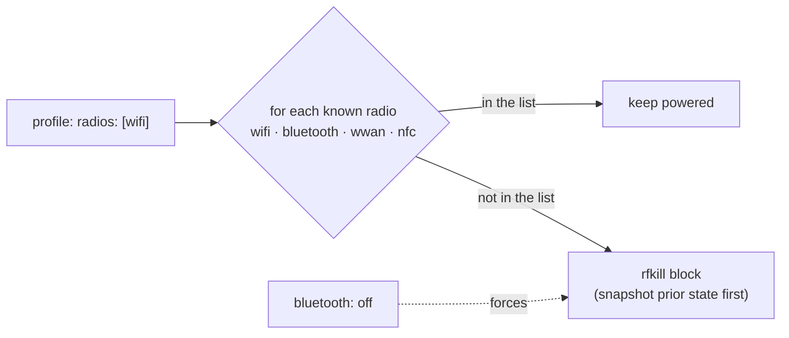
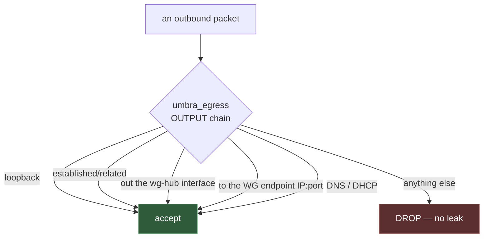
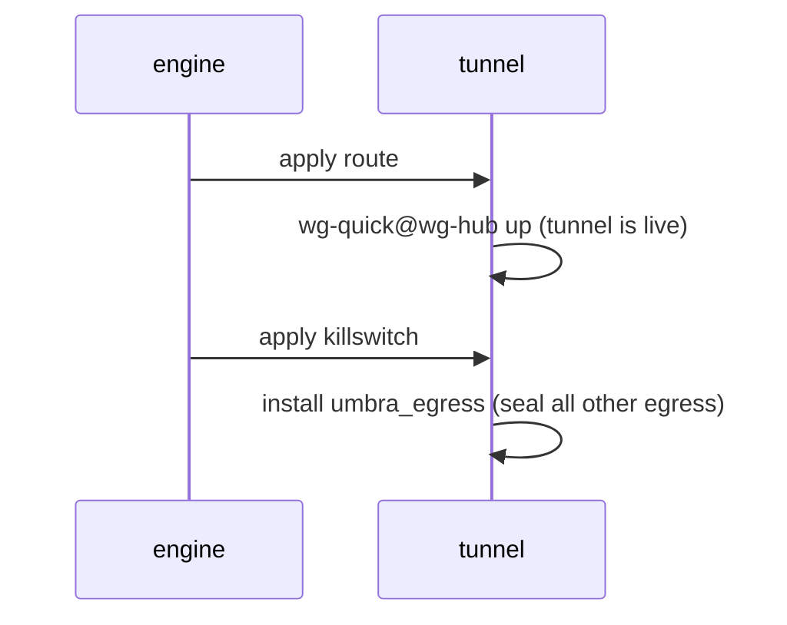
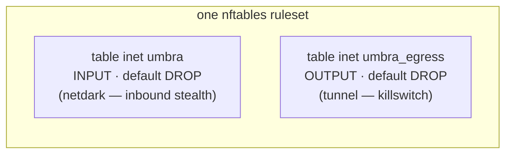

# Phase 2 — RF signature + Tunnel killswitch

> Learning companion (Mermaid diagrams render on GitHub). Phase 1 built the
> engine and the two "walls" modules (netdark, telemetry). Phase 2 adds the two
> modules that touch **radios** and **where your traffic goes**.

Everything still obeys the Phase-1 rule: **measure → snapshot → mutate → verify**,
and never mutate what you haven't snapshotted. If that isn't fresh, re-skim
[PHASE-1.md](PHASE-1.md) first.

---

## 1. rf — shrinking your radio-frequency signature

Two ideas: **randomize** the identity of radios you keep on, and **kill** the
radios you don't need.

### The MAC / probe fingerprint

Your WiFi card has a MAC address — a globally-unique serial number it shouts in
every "is my network here?" probe. Left alone, that's a durable tracking beacon
across every coffee shop you visit. The `rf.mac` control drops a NetworkManager
config that (a) randomizes the MAC and (b) randomizes it *during scanning* too,
so the probe fingerprint stops being stable.

```
per-network  ->  cloned-mac-address = stable   (same MAC per SSID, differs across networks)
per-boot/full -> cloned-mac-address = random   (fresh MAC every connection)
always        -> wifi.scan-rand-mac-address = yes  (no stable probe fingerprint)
```

The Python worth noticing: `_mac_conf_text()` and `_radios_to_block()` are
**pure functions** — inputs in, string/list out, no system calls. That's a
deliberate style choice: pure logic is trivial to unit-test (see
`tests/test_rf.py`), so the fiddly, hard-to-test system calls stay thin.

### The radio permit-list

A profile's `radios:` list is the radios **allowed** to stay powered. Anything
not on the list gets a hard `rfkill` soft-block.



`radios: []` blocks everything — the closest thing to true invisibility short of
airplane mode. Each blocked radio is its **own** control (`rf.radio_bluetooth`,
`rf.radio_wwan`, …) so each gets its own snapshot and restores independently.

---

## 2. tunnel — force traffic through the VPN, cut everything else

Two controls: **route** (bring the tunnel up) and **killswitch** (drop anything
that isn't the tunnel).

### The killswitch, visually

A killswitch is an egress firewall with a **default-DROP** policy. Only a short
allow-list gets out:



If the tunnel drops, ordinary traffic has no path out — it hits the DROP policy
instead of silently falling back to the naked internet. That's the whole point.

### Wiring to your wg-hub

`tunnel.profile_ref: wg-hub` points at your existing homevpn WireGuard config at
`/etc/wireguard/wg-hub.conf`. The module:

1. reads the `Endpoint = host:port` line (`_endpoint_from_conf`, a pure function),
2. resolves a hostname (your DuckDNS name) to an IP so the firewall can allow it,
3. brings the interface up via `wg-quick@wg-hub.service`,
4. installs the killswitch allowing that endpoint.

### Order within tunnel: route *then* killswitch



Bring the tunnel up first, *then* seal egress — so a dynamic-hostname endpoint
can be resolved and handshaked before the wall goes up.

---

## 3. How two firewalls coexist (the integration puzzle)

netdark and tunnel both use nftables. If they both flushed the ruleset they'd
clobber each other. The design keeps them in **separate tables** with different
jobs, and only netdark ever flushes:



- **netdark** (applied first) does `flush ruleset` + loads its INPUT table. It
  snapshots the *entire* prior ruleset → restore reloads all of it.
- **tunnel** (applied after) *adds* its `umbra_egress` table without flushing. Its
  undo is the new `nftables_table_delete` primitive — "remove just our table."

On restore (reverse order) tunnel removes its table, then netdark reloads the
full pre-Umbra ruleset. Net result: exactly stock.

---

## 4. Two new restore primitives

Phase 1 said *restore is data, not code* — a snapshot names a primitive from a
closed set. Phase 2 adds two, keeping that discipline:

| Primitive | Undoes | Restore data |
|-----------|--------|-------------|
| `rfkill_set` | a radio block | `{identifier, was_blocked}` → `rfkill block/unblock` |
| `nftables_table_delete` | a layered-on table | `{family, table}` → `nft delete table` |

`tests/test_restore.py` proves each issues exactly the right command, using a
`FakeRunner` that records calls instead of running them — so the safety-critical
undo logic is tested on any OS, no root or radios required.

---

## 5. What's real vs deferred (kept honest in `status`)

| | Real in Phase 2 | Deferred |
|---|---|---|
| **rf** | MAC randomization, radio kill (rfkill) | bluetooth *non-discoverable* toggle → 2.1 |
| **tunnel** | WireGuard route + killswitch, DNS/IPv6 leak guard | Tor mode → 2.1; WebRTC (browser-level, advisory) |

`umbra status paranoid` shows `tunnel.route` as *"Tor mode is Phase 2.1"* rather
than pretending — the tool never claims a guarantee it isn't enforcing.

---

## 6. Verify on Kali (in a VM you can recover!)

```bash
sudo umbra --dry-run apply travel   # rehearse: see route + killswitch actions
sudo umbra apply travel             # for real
```

Then confirm:
- `ip link show wg-hub` — interface is up.
- `sudo nft list table inet umbra_egress` — the killswitch table exists.
- `sudo wg-quick down wg-hub && curl -m5 https://example.com` — **fails** (killswitch
  holds when the tunnel is down). Bring it back with `wg-quick up wg-hub`.
- `rfkill list` — bluetooth/wwan/nfc show `Soft blocked: yes`.
- `ip link | grep -A2 wlan` then reconnect — a randomized MAC.

Finally: `sudo umbra normal` and confirm the egress table is gone, radios
unblock, and the MAC drop-in is removed.

---

### The one-liner for Phase 2

**Randomize what you keep on, kill what you don't, force the rest through the
tunnel — and DROP anything that tries to go around it.**
