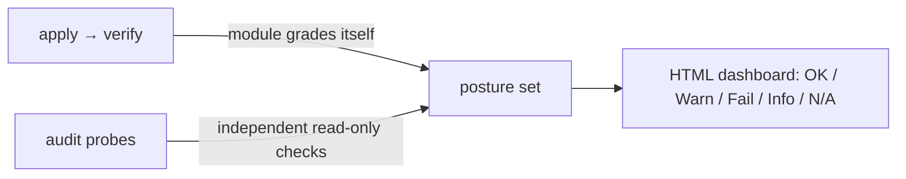
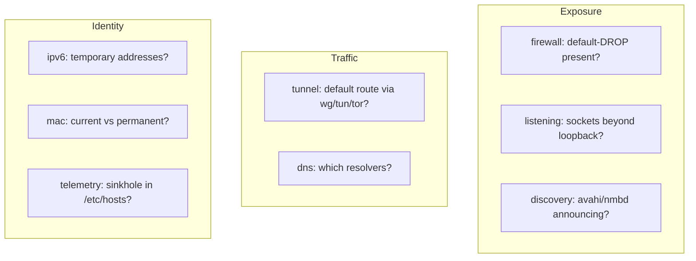
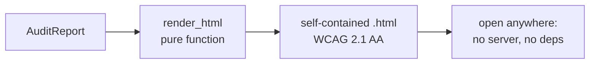

# Phase 3 — Audit & the posture dashboard

> Learning companion (Mermaid renders on GitHub). Phases 1–2 *change* the machine.
> Phase 3 answers a different question: **how do you know it worked?** It proves
> the posture with independent, read-only checks and renders them as an
> accessible HTML dashboard.

---

## 1. Why a separate audit at all

`apply` already runs `verify()` after each control. So why re-check?

Because `verify()` asks the *module* "did your own change take?" — the same code
that made the change grades its own work. The **audit is an independent second
opinion**: probes that don't trust the modules, looking at the machine from the
outside (open sockets, the live routing table, what's actually in `/etc/hosts`).
If the module lied or something drifted afterwards, the audit still catches it.



---

## 2. A check is data, the probes are pure-ish

Each probe returns a `Check` — a small dataclass:

```python
Check(id, title, category, status, evidence, recommendation)
```

`status` is a `Status` enum with five values, chosen so the dashboard can be
honest about uncertainty:

| Status | Meaning |
|--------|---------|
| `OK`   | as hardened as this check wants |
| `WARN` | exposed / not hardened |
| `FAIL` | actively leaking or wide open |
| `INFO` | a neutral fact, no judgement |
| `N/A`  | couldn't determine (tool/permission missing) |

The `N/A` value is what lets the whole audit run on your Windows dev box: every
probe degrades to `N/A` instead of throwing when `nft`/`ss`/`/etc/hosts` aren't
there. On Kali they light up for real.

The eight Phase-3 probes:



---

## 3. The dashboard, and why it's built the way it is

`umbra audit --html out.html` writes a **self-contained** page (all CSS inline,
no server, no build step). `render_html(report)` is a pure function — report in,
HTML string out — which is why it's trivially unit-tested (`tests/test_report.py`
even checks that evidence text is HTML-escaped, so a hostile socket name can't
inject markup).

### Accessibility is a requirement, not a polish pass

The page is built to **WCAG 2.1 AA** from the first line, because a security tool
whose report can't be read by everyone is only half a tool:

- **status is never colour alone** (SC 1.4.1) — every badge is `icon + word`
  (`● OK`, `▲ Warning`, `✕ Fail`), so it survives colour-blindness and greyscale;
- **AA contrast in both themes** — the palette has separate dark and light token
  sets, each computed to ≥ 4.5:1;
- **landmarks + headings** — `banner` / `main` / `contentinfo`, one `<h1>`, a real
  `<table>` with `<th scope>` for columns *and* rows;
- **keyboard**: a skip link, and a global `:focus-visible` ring;
- **`prefers-reduced-motion`** honoured.



---

## 4. Try it

```bash
umbra audit home                 # terminal: OK/WARN/FAIL per check + evidence
umbra audit travel --html out.html   # + an accessible dashboard you can open
umbra audit --json home          # machine-readable, for piping/automation
```

On Kali after `umbra apply home`, the firewall/discovery/ipv6/telemetry checks
flip to `OK` and you can *see* the posture — you're not trusting a claim.

---

## 5. Deferred (kept honest)

- A **live** dashboard (re-runs the audit on refresh) is Phase 3.1 — the current
  page is a point-in-time snapshot.
- Deeper leak tests (active DNS-leak probe, a real inbound port-scan from a second
  host, a broadcast sniff) grow here next.

---

### One-liner for Phase 3

**Don't trust the tool — prove the posture with independent read-only checks, and
render the proof so anyone can read it.**
