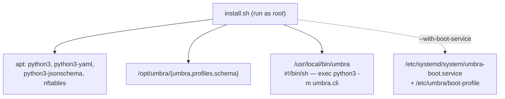
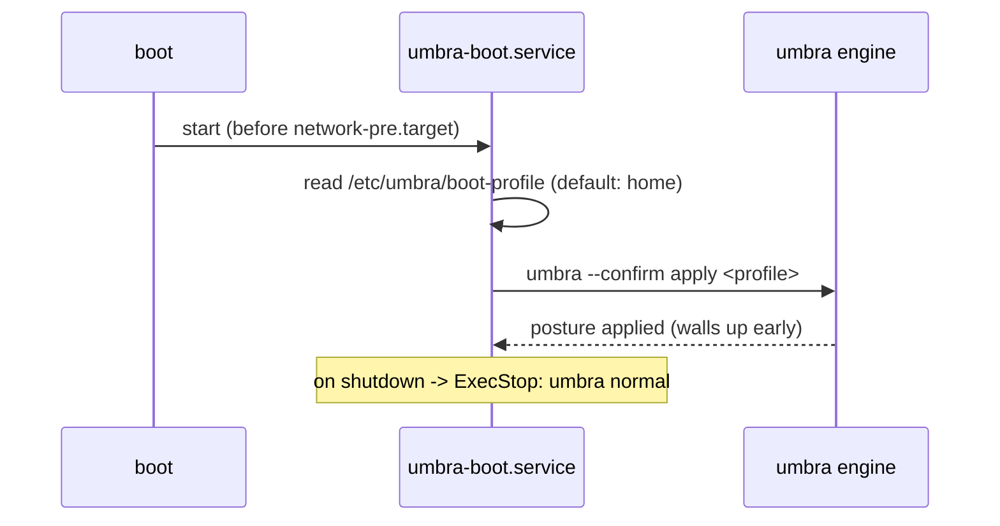
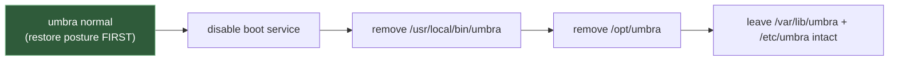

# Phase 4 — Packaging & boot integration

> Learning companion (Mermaid renders on GitHub). Phases 1–3 built the engine,
> the modules, and the audit. Phase 4 makes umbra a **real system command** you
> install once and can trigger at boot — without the Python-packaging friction.

---

## 1. The install shape

`pip install -e .` is great for development, but on Kali/Debian modern Python is
"externally managed" (PEP 668) and fighting pip on a system box is a bad time.
So the installer uses **distro packages for the deps** and drops the code in a
fixed place with a thin launcher:



The launcher is four lines: set `PYTHONPATH=/opt/umbra`, exec `python3 -m
umbra.cli "$@"`. Because `paths.py` derives the repo root from its own location,
`/opt/umbra/umbra/paths.py` resolves profiles at `/opt/umbra/profiles` with zero
config. The runtime state lives at `/var/lib/umbra` (already the installed-system
default from Phase 1).

Everything is **idempotent** — re-running `install.sh` cleanly replaces the code.

---

## 2. Go dark at boot

`--with-boot-service` installs a systemd oneshot that applies a configured
profile as the machine comes up:



Two deliberate choices:
- **`Before=network-pre.target`** — raise the firewall/telemetry walls *before*
  the network is fully up, so there's no exposed window at boot.
- **`ExecStop=umbra normal`** — stopping the service (or shutdown) restores stock,
  so the boot posture is symmetric.

You pick the posture by writing a profile name into one file:
```bash
echo travel | sudo tee /etc/umbra/boot-profile   # go into travel mode on boot
```

---

## 3. Uninstall can't strand you

The risk with a tool that installs a default-DROP firewall and a boot service:
what if removing it leaves you dark? `uninstall.sh` is ordered to prevent that.



Restore-before-remove is enforced by a test (`tests/test_packaging.py`) that
checks `umbra normal` appears *before* the `rm -rf /opt/umbra` line — a lint that
runs on any OS, since we can't install on the dev box.

---

## 4. Try it (on Kali, in a recoverable VM)

```bash
sudo ./install.sh                       # umbra is now on your PATH
umbra status home
sudo umbra apply home
sudo ./install.sh --with-boot-service   # + apply a posture every boot
echo travel | sudo tee /etc/umbra/boot-profile
man umbra                               # the installed man page
sudo ./uninstall.sh                     # restores posture, then removes
```

---

## 5. Deferred

- A signed **`.deb`** (proper `debian/` packaging, dependencies declared in
  control) — this phase ships a working installer; the `.deb` is the next step.
- **polkit** action so an unprivileged desktop user can trigger a posture without
  a root shell.

---

### One-liner for Phase 4

**One command to install, one file to choose your boot posture, and an uninstall
that always hands the machine back the way it found it.**
