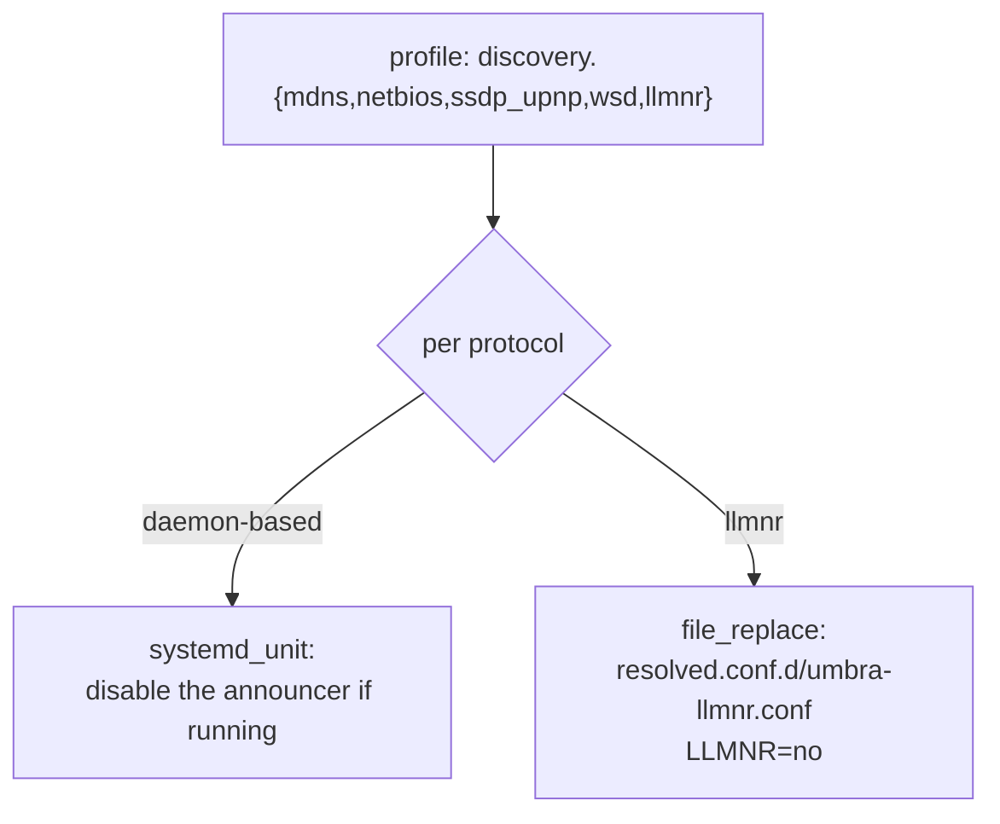
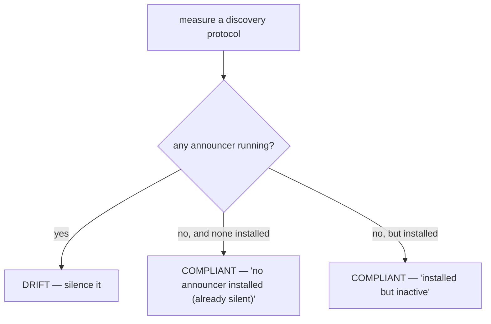

# Phase 5 — Completing the discovery controls

> Learning companion. Phase 1 shipped `netdark` with two discovery silencers
> (mDNS, NetBIOS) and three placeholders marked "Phase 1.5". Phase 5 makes good
> on them — `llmnr`, `ssdp_upnp`, and `wsd` — and, just as importantly, teaches
> the module to tell the truth when there's nothing to silence.

---

## 1. The five local-discovery protocols

Your machine can announce itself on a LAN in several ways. Each is a separate
chatter channel a nearby observer can catalogue:

| Protocol | Who emits it | How umbra silences it |
|----------|--------------|-----------------------|
| **mDNS** | `avahi-daemon` | stop + disable the unit |
| **NetBIOS** | `nmbd` (Samba) | stop + disable the unit |
| **SSDP/UPnP** | `miniupnpd` / `minissdpd` | stop + disable whichever is running |
| **WS-Discovery** | `wsdd` | stop + disable the unit |
| **LLMNR** | `systemd-resolved` *itself* | config drop-in (`LLMNR=no`) |

The first four are **daemons** — silencing them is "turn the service off." LLMNR
is different: it's emitted by systemd-resolved, which you *don't* want to disable
(it's your DNS). So llmnr is handled by a resolved **drop-in** instead.



---

## 2. The honest part: "already silent" is a pass, not a placeholder

The old code marked `ssdp_upnp`/`wsd` as `UNSUPPORTED — Phase 1.5`. But on most
Linux boxes those daemons **aren't even installed** — so the protocol isn't being
announced at all. Reporting that as "unsupported" was misleading.

Now `measure()` reasons about what's actually true:



So on a stock machine you now see `ssdp_upnp` and `wsd` as **OK** with the reason
*"already silent"* — the tool tells you the truth instead of hedging.

---

## 3. One snapshot per unit (a subtlety worth seeing)

SSDP/UPnP has two possible announcers (`miniupnpd` *and* `minissdpd`). If both
were running, one control disabling both would need two snapshots — but a
snapshot file is keyed by control id, so they'd collide.

The fix: the control *reports* at the protocol level (`netdark.ssdp_upnp`), but
`apply()` snapshots each unit under its **own** id
(`netdark.ssdp_upnp_miniupnpd`, `netdark.ssdp_upnp_minissdpd`). Same trick as
`rf.radio_<type>`: one status line, independent undo per thing changed.

---

## 4. The one caveat (stated plainly)

LLMNR is silenced by writing a resolved drop-in and restarting `systemd-resolved`.
On restore, the drop-in file is removed — but LLMNR only truly comes back on the
*next* resolved restart or reboot, because a restore primitive writes data, it
doesn't run services. Every other discovery control (the daemon ones) reverts
immediately. On many systems (Kali included) systemd-resolved isn't the active
resolver at all, so llmnr simply reports COMPLIANT — nothing to do.

---

## 5. Try it

```bash
umbra status home        # now lists all 5 discovery protocols, no placeholders
sudo umbra apply home    # mdns/netbios silenced if present; ssdp/wsd 'already silent'
umbra audit home         # the discovery check reflects the real state
```

---

### One-liner for Phase 5

**Silence every discovery channel the profile asks for — and when there's nothing
to silence, say so honestly instead of hiding behind a placeholder.**
