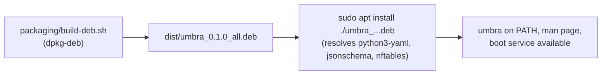
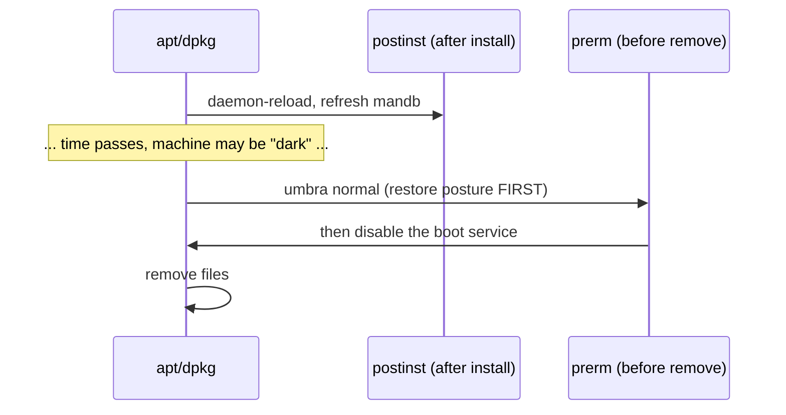

# Phase 6 — A real Debian package

> Learning companion. Phase 4 gave umbra an `install.sh`. Phase 6 goes one step
> further: a proper `.deb` you can `apt install`, that declares its dependencies,
> preserves your config across upgrades, and — critically — **restores your
> machine's posture when you remove it**.

---

## 1. Why a `.deb` on top of install.sh?

`install.sh` is fine for "clone and run." A `.deb` gives you what a package
manager is for:

- **dependency resolution** — `apt` pulls in `python3-yaml`, `python3-jsonschema`,
  `nftables` automatically (declared in `Depends:`);
- **a file manifest** — `dpkg -L umbra` lists exactly what's installed, and
  removal is clean and complete;
- **conffile handling** — your `/etc/umbra/boot-profile` survives upgrades;
- **maintainer scripts** — code that runs at install/remove time, which is where
  the safety guarantee lives.



---

## 2. The package layout

A `.deb` is just an archive with a file tree plus a `DEBIAN/` control directory.
umbra's tree uses the FHS-correct locations for a *packaged* (not local) install:

| Path | What |
|------|------|
| `/usr/lib/umbra/{umbra,profiles,schema}` | the code + data |
| `/usr/bin/umbra` | wrapper (in PATH **and** sudo's secure_path) |
| `/usr/share/man/man1/umbra.1` | man page |
| `/lib/systemd/system/umbra-boot.service` | the boot service |
| `/etc/umbra/boot-profile` | a **conffile** (edits preserved) |

`paths.py` needs zero changes: it derives its root from its own location, so
`/usr/lib/umbra/umbra/paths.py` finds profiles at `/usr/lib/umbra/profiles`.

---

## 3. The maintainer scripts (where the safety lives)

Two scripts run at package-management time:



The **`prerm`** is the important one. Before `apt` deletes umbra's files, it runs
`umbra normal` — so removing the package can never leave your firewall in
default-DROP or your `/etc/hosts` sinkholed. Same restore-before-remove principle
as `uninstall.sh`, now enforced by the package manager itself. A test asserts the
`umbra normal` call appears inside `prerm`.

---

## 4. Try it (on Kali)

```bash
packaging/build-deb.sh                       # -> dist/umbra_0.1.0_all.deb
sudo apt install ./dist/umbra_0.1.0_all.deb  # resolves deps
umbra status home
sudo umbra apply home && umbra audit home
dpkg -L umbra                                # the file manifest
sudo apt remove umbra                        # prerm runs `umbra normal` first
```

---

## 5. Deferred

- Signing + an `apt` repository (so `apt update && apt install umbra` works from a
  hosted repo) — this phase produces the artifact; hosting it is next.
- A source package / `debian/` dir built with `dpkg-buildpackage` for Debian
  policy compliance. `build-deb.sh` is the pragmatic first cut.

---

### One-liner for Phase 6

**Ship it as a package that pulls its own dependencies, keeps your config, and
hands the machine back to stock the moment you remove it.**
