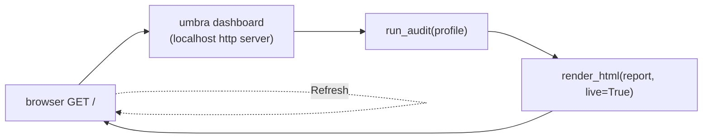

# Phase 7 — The live dashboard server

> Learning companion. Phase 3 generated a *static* HTML posture report. Phase 7
> serves a **live** one: `umbra dashboard` runs a tiny localhost web server that
> re-runs the audit on every page load.

---

## 1. What it adds over `audit --html`

`umbra audit --html out.html` is a snapshot — accurate the moment you ran it.
`umbra dashboard` keeps a window open on the machine's posture:



Every request re-measures and re-renders, so after you `umbra apply` in another
terminal, a Refresh shows the checks flip to OK in real time.

---

## 2. Deliberately tiny (and dependency-free)

The server is Python's standard-library `http.server` — no Flask, no FastAPI, no
new dependency to install or audit. That matters for a security tool: less code
in the trusted path.

- bound to **127.0.0.1** only (never exposed off-box);
- `Cache-Control: no-store` so a stale posture is never shown;
- every path but `/` returns 404;
- read-only, so it needs no privilege gate (without root the checks simply read
  `N/A`, exactly like `umbra audit`).

```python
def do_GET(self):
    report = run_audit(runner, profile)          # re-measure live
    body = render_html(report, live=True).encode()
    self.send_response(200)
    self.send_header("Cache-Control", "no-store")
    ...
```

---

## 3. "Live" without breaking accessibility

The obvious way to auto-update a dashboard is `<meta http-equiv="refresh">`. But
a forced timed refresh trips **WCAG 2.2.1 (Timing Adjustable)** — it can yank the
page out from under someone mid-read. So live mode instead adds a plain
**Refresh link**: the viewer decides when to re-check. A test asserts the link is
present *and* that no `http-equiv="refresh"` sneaks in.

---

## 4. Try it

```bash
sudo umbra dashboard home            # http://127.0.0.1:8799
sudo umbra dashboard travel --port 9000
# in another terminal:
sudo umbra apply home                # then Refresh the page -> checks go green
```

Validated on Kali: with `home` applied, the server returns HTTP 200 and the page
shows the real posture (firewall "stealth ruleset active (default DROP)", the
discovery and telemetry checks green), with the Refresh link.

---

## 5. Deferred

- Auto-refresh **as an opt-in** (a pause/play control + `aria-live` region) rather
  than a forced timer — accessible live updates.
- Multiple profiles / a profile switcher in the UI.

---

### One-liner for Phase 7

**A live window on your posture, served from twenty lines of standard library —
and it refreshes when you say so, not when a timer says so.**
