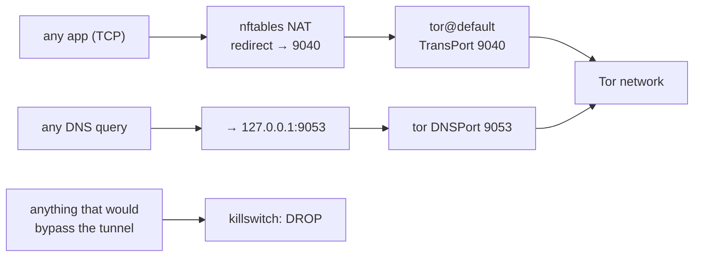
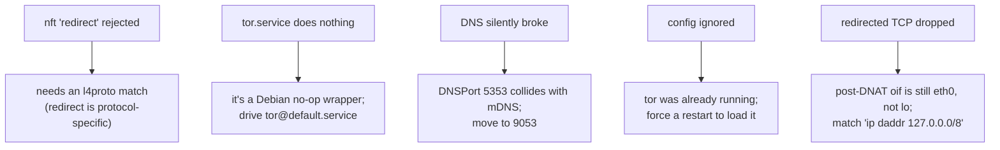

# Phase 8 — Tor transparent-proxy mode (the anonymity layer)

> Learning companion. Phases 1–7 hardened the device and proved posture with an
> audit. Phase 8 adds the piece that changes *who you are on the internet*: route
> **all** traffic through Tor at the kernel level, so every app is anonymized
> whether it knows about Tor or not — and prove it's leak-tight.

A SOCKS proxy only anonymizes apps you configure to use it. A **transparent
proxy** anonymizes the whole machine: the firewall itself redirects traffic into
Tor, so there is no per-app setting to forget and no app that can opt out. This is
what `paranoid` turns on.

---

## 1. The shape of it

Three moving parts:

1. **TCP redirect** — an nftables NAT rule sends outbound TCP to Tor's
   `TransPort 9040`.
2. **DNS redirect** — UDP/TCP port 53 is DNAT'd to Tor's `DNSPort 9053`, and
   `/etc/resolv.conf` is pointed at `127.0.0.1`, so no lookup escapes in the clear.
3. **Killswitch** — anything that isn't going into Tor is dropped. No tunnel, no
   traffic.

`umbra audit paranoid` then hits the Tor Project's check endpoint and confirms
`IsTor: true` — end-to-end proof, not a claim.

## 2. Five bugs the Kali VM found (why we validate on real hardware)

This mode looked correct on paper and was **wrong five different ways** until it
ran on an actual Kali VM. Each one is a lesson:

1. **`redirect` needs a layer-4 match.** nftables rejects a bare `redirect` — the
   redirect statement is protocol-specific, so the rule must match `meta l4proto
   tcp` (or `udp`) first.
2. **`tor.service` is a decoy.** On Debian/Kali `tor.service` is a no-op wrapper
   that starts nothing. The real instance is `tor@default.service`. Starting the
   wrapper "succeeds" and leaves Tor down.
3. **`DNSPort 5353` collides with mDNS.** 5353 is multicast DNS (Avahi). Tor's
   DNSPort there fights the mDNS responder and lookups fail intermittently. Moving
   it to **9053** fixes it.
4. **A running Tor won't reload on its own.** If Tor was already up, dropping a new
   `torrc` does nothing until it restarts — so `tor_config` **forces** a restart
   rather than assuming a reload.
5. **The killswitch dropped its own redirected traffic.** The obvious filter rule
   "allow traffic out `lo`" doesn't work: after the NAT DNAT to `127.0.0.1`, the
   packet's output interface is **still `eth0`**, not `lo`. The correct match is on
   the destination address — `ip daddr 127.0.0.0/8` — not the interface.

Bug 5 is the subtle one, and the reason a transparent proxy is easy to get
*almost* right: everything looks configured, Tor is running, and yet every
redirected connection is silently dropped because the allow-rule never matches.

## 3. Why this belongs to the engine, not a script

Tor mode is four reversible controls — `tor_config`, `tor_route` (the NAT
redirect), `tor_dns`, and `tor_killswitch` — each snapshotted before it mutates,
each verified after. `paranoid` **requires** them (via the capability system), so
the audit refuses to score the profile green unless all four are verified on the
wire. Turn `paranoid` off and every one reverts: the redirect rules come out, the
original `resolv.conf` comes back, and Tor returns to how you found it.

That's the whole point of doing it inside the reconciler instead of a
`torify`-style shell script: it's **reversible**, **verified**, and **provable** —
the same three properties every other Umbra control has.

---

### One-liner for Phase 8

**Push the entire machine through Tor at the firewall — no per-app config, a
killswitch so nothing leaks around it, and an audit that proves `IsTor: true` —
built as four reversible controls the reconciler owns.**
