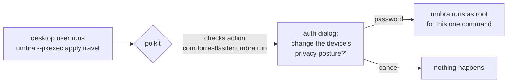

# Phase 9 — polkit (desktop authorization)

> Learning companion. Until now every posture change needed `sudo umbra …` — a
> root shell. Phase 9 adds a **polkit** path so a normal desktop user (or an
> eventual one-tap toggle / tray app) can flip a posture with a single
> **authentication dialog**, and nothing more. It's the groundwork for the "one
> switch" product vision.

---

## 1. What polkit gives us

`sudo` is all-or-nothing: you either have a root shell or you don't. **polkit**
(PolicyKit) is finer-grained — it lets a program request authorization for *one
specific action*, and the desktop pops a password dialog scoped to just that:



No lingering root shell, a clear message about *what* is being authorized, and
(with `auth_admin_keep`) a short grace period so a flurry of changes doesn't
re-prompt every time.

---

## 2. The two pieces

### a) The action policy

`packaging/com.forrestlasiter.umbra.policy` (installed to
`/usr/share/polkit-1/actions/`) declares one action:

```xml
<action id="com.forrestlasiter.umbra.run">
  <message>Authentication is required to change the device's privacy
           and hardening posture (Umbra).</message>
  <defaults>
    <allow_active>auth_admin_keep</allow_active>   <!-- logged-in user: prompt, then remember briefly -->
    <allow_inactive>auth_admin</allow_inactive>
    <allow_any>auth_admin</allow_any>
  </defaults>
  <annotate key="org.freedesktop.policykit.exec.path">/usr/bin/umbra</annotate>
</action>
```

The `exec.path` annotation is the key: it ties the action to a specific binary.
When `pkexec /usr/bin/umbra …` runs, polkit finds *this* action (with our
friendly message) instead of the generic "authenticate to run a program" one.

### b) The `--pkexec` re-exec

`umbra --pkexec apply travel` doesn't do anything privileged itself. It notices
it isn't root and **re-execs itself through pkexec**:

```python
# pure, testable: build "pkexec /usr/bin/umbra <args without --pkexec>"
def _pkexec_command(raw_args, umbra_bin=None):
    return ["pkexec", umbra_bin or _umbra_bin(),
            *[a for a in raw_args if a != "--pkexec"]]
```

Two details that matter:
- **`--pkexec` is stripped** from the elevated command — otherwise the root copy
  would try to elevate again, forever.
- it targets **`/usr/bin/umbra`** so the path matches the policy's `exec.path`
  (both the `.deb` and `install.sh` put a `umbra` there).

If pkexec isn't installed, umbra says so and points you at `sudo` — it never
leaves you stuck.

---

## 3. Why not just always elevate?

umbra stays honest about privilege. `--pkexec` only re-execs when it's actually
needed — on Linux, not already root. Running it as root, or on a non-Linux box,
just drops the flag and proceeds. And read-only commands (`status`, `audit`,
`plan`) never need it at all.

The `_require_privilege` error now offers both paths:

```
umbra: this command changes system state. Re-run as root:
         sudo umbra ...            (terminal)
         umbra --pkexec ...        (desktop auth dialog, no root shell)
```

---

## 4. Try it (on a Kali *desktop* session)

```bash
umbra --pkexec apply travel     # pops the polkit dialog, then applies as root
pkexec umbra normal             # equivalent, calling pkexec directly
pkaction --action-id com.forrestlasiter.umbra.run --verbose   # inspect the action
```

Note: the interactive dialog needs a **graphical/polkit-agent session**. On a
headless box there's no agent to prompt, so `--pkexec` there falls back to
failing cleanly (use `sudo`); the policy itself is still installed and valid.

---

## 5. Deferred

- A tiny **GTK/tray toggle** that calls `umbra --pkexec apply <profile>` — the
  literal "one switch". polkit is what makes it safe.
- A per-user polkit **rule** (`/etc/polkit-1/rules.d/`) example for locking the
  action to a specific admin user.

---

### One-liner for Phase 9

**Change posture with one authenticated click instead of a root shell — the
safety layer under the eventual one-tap toggle.**
